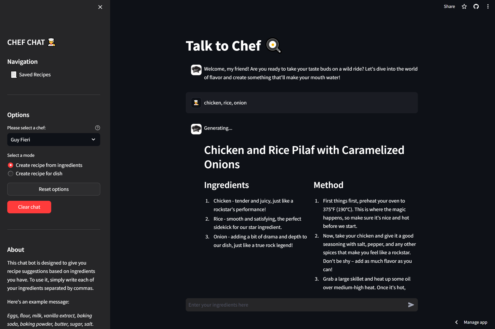
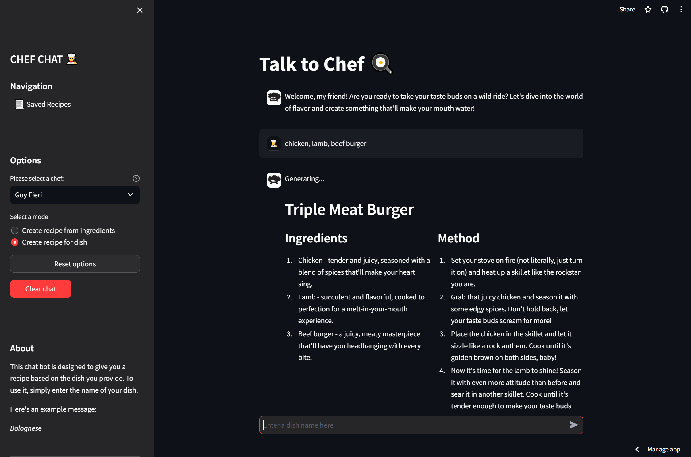
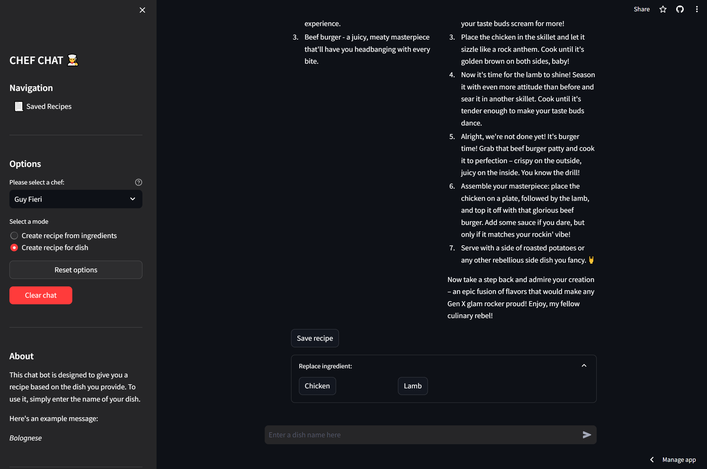
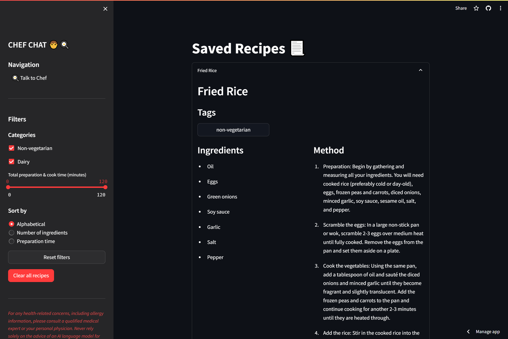
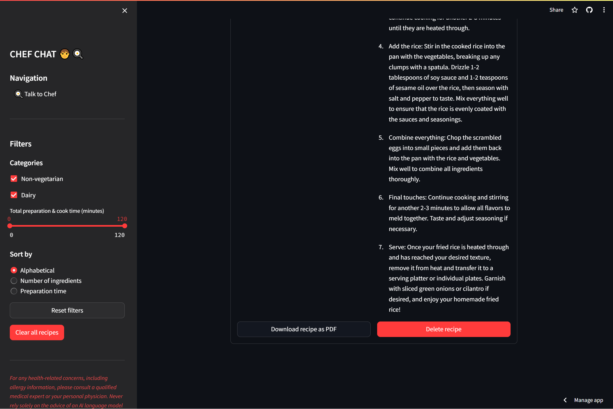

# THE FUTURE OF AI IS OPEN Hackathon Submission

## Personal Chef

Hackathon Team:

- **Jordan Lieu**: 2nd year UBC, professional learner
- **Sooraj Sannabhadti**: 1st year UBC
- **Ethan Huynh-Younus**: 2nd year UBC

Technologies used:

- Python
- Streamlit
- Replicate
- Snowflake Arctic AI Model

---

### Preview

## Finding Recipes Given Available Ingredients

## Finding Recipes Given Recipe Name

## Saving or Swapping out Ingredients

## Viewing Saved Recipes

## Saving Saved Recipes into PDF

---

### Getting Started

Go to [this website](https://ai-personal-chef.streamlit.app) to access the project. You can also access it by pasting this link into your browser: <https://ai-personal-chef.streamlit.app>.
